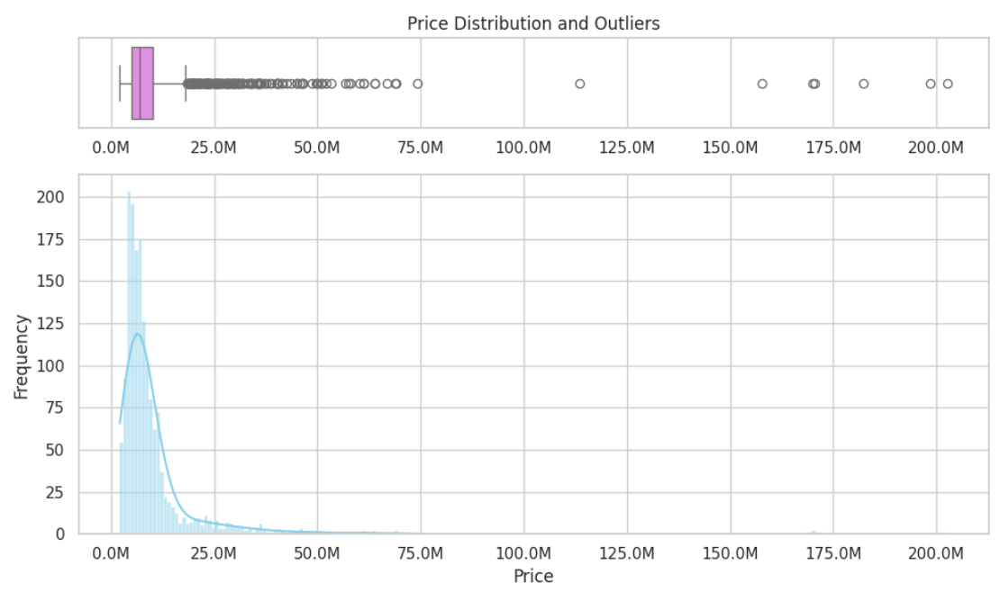
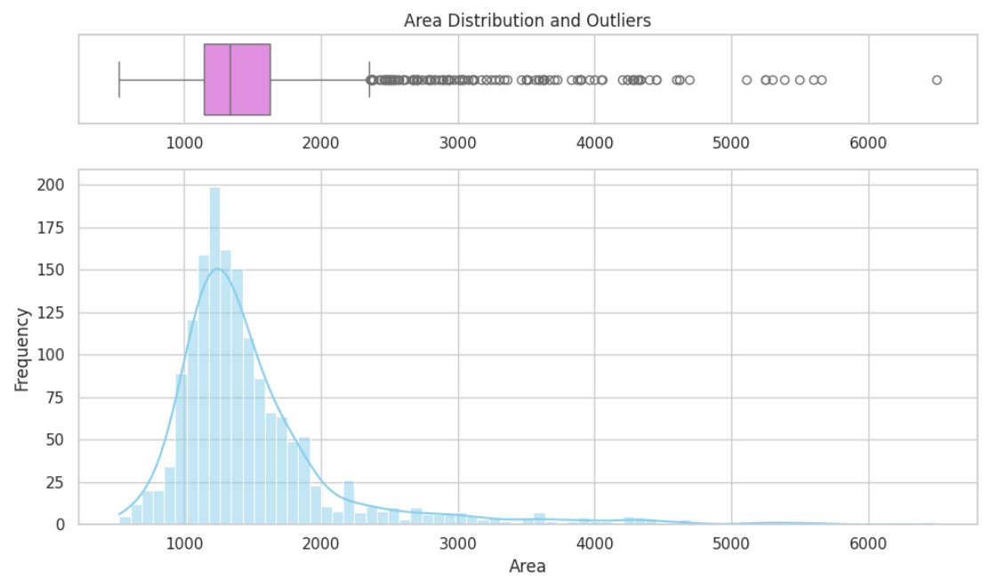

# CSI4142Project

## Installations 

<!-- pip install pandas
pip install sqlalchemy
pip install scikit-learn
pip install matplotlib
pip install seaborn -->

## Sample Output 

Before cleaning 6207
Number of rows before dropping Full 9s: 6207
c:\Users\ishan\OneDrive\Documents\GitHub\CSI4142Project\FinalPart2.py:44: FutureWarning: DataFrame.applymap has been deprecated. Use DataFrame.map instead.
  rows_to_drop = df.applymap(contains_exactly_9).any(axis=1)
Number of rows after dropping Full 9s:: 1946
After cleaning 1594
First 10 Rows of Fact Table 
   index                         Location  ...  CommunityID  IndoorRoomID
0      0                 JP Nagar Phase 1  ...          1.0           1.0
1      1       Dasarahalli on Tumkur Road  ...          2.0           2.0
2      2  Kannur on Thanisandra Main Road  ...          3.0           3.0
3      3                     Doddanekundi  ...          4.0           4.0
4      4                          Kengeri  ...          5.0           5.0
5      5                         Horamavu  ...          6.0           6.0
6      6                      Thanisandra  ...          7.0           7.0
7      7                 Ramamurthy Nagar  ...          8.0           8.0
8      8    Whitefield Hope Farm Junction  ...          9.0           9.0
9      9          Electronic City Phase 1  ...         10.0          10.0

[10 rows x 9 columns]
First 10 Rows of Household Dimension 
   WashingMachine     AC  ...  Refrigerator  HouseHoldApplianceID
0           False  False  ...         False                     1
1           False  False  ...         False                     2
2           False  False  ...         False                     3
3           False  False  ...         False                     4
4           False  False  ...         False                     5
5           False  False  ...         False                     6
6           False  False  ...         False                     7
7           False  False  ...         False                     8
8           False  False  ...         False                     9
9           False  False  ...         False                    10

[10 rows x 7 columns]
First 10 Rows of Outdoor Amentities Dimension  
   SwimmingPool  LandscapedGardens  ...  RainWaterHarvesting  OutdoorAmentitiesID
0          True               True  ...                 True                    1
1          True               True  ...                 True                    2
2          True               True  ...                 True                    3
3         False              False  ...                False                    4
4          True               True  ...                 True                    5
5          True               True  ...                 True                    6
6          True               True  ...                False                    7
7         False              False  ...                 True                    8
8          True               True  ...                 True                    9
9          True               True  ...                 True                   10

[10 rows x 5 columns]
First 10 Rows of Community Dimension 
   ShoppingMall  SportsFacility  School  Hospital  CommunityID
0         False            True   False     False            1
1         False            True   False     False            2
2         False           False   False     False            3
3         False           False   False     False            4
4         False            True   False     False            5
5         False            True   False     False            6
6         False           False   False     False            7
7         False           False   False     False            8
8         False           False   False     False            9
9          True           False   False     False           10
First 10 Rows of Indoor Room Dimension
   NumOfBedrooms  Gymnasium  ...  ChildrenPlayArea  IndoorRoomID
0              4       True  ...              True             1
1              2       True  ...              True             2
2              2       True  ...              True             3
3              3      False  ...             False             4
4              3       True  ...              True             5
5              2       True  ...              True             6
6              4       True  ...              True             7
7              3       True  ...              True             8
8              3       True  ...             False             9
9              1       True  ...              True            10

[10 rows x 7 columns]

